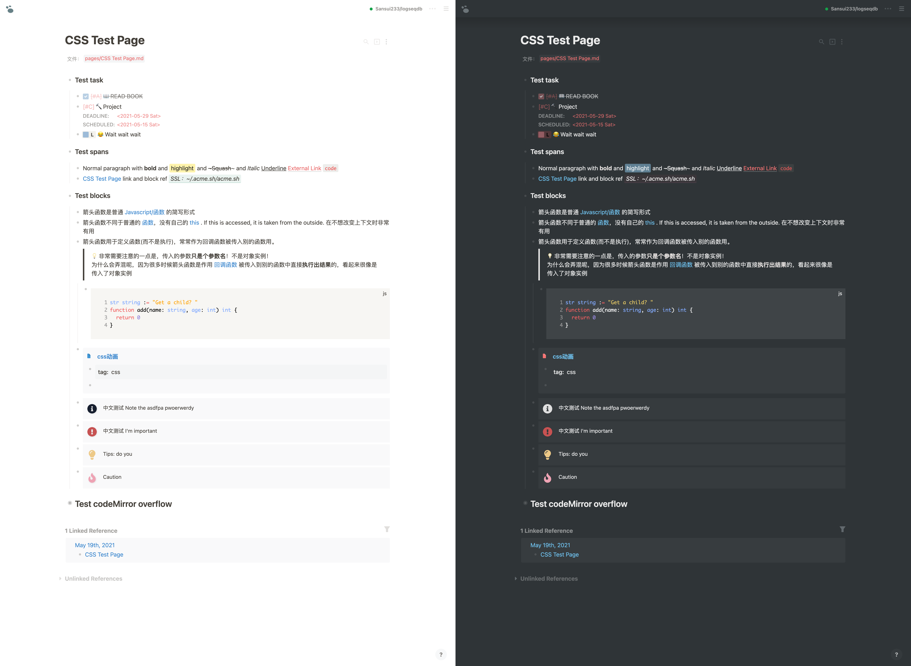
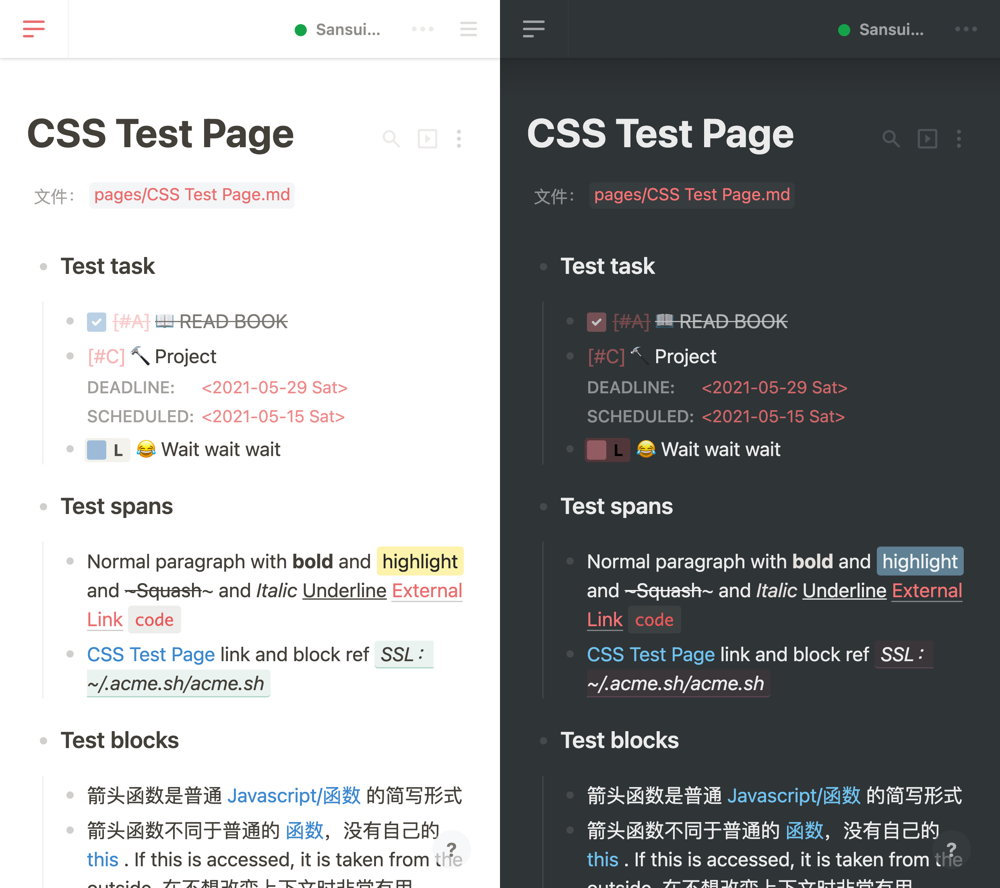

# logseq-bonofix-theme

This is a theme for [Logseq](https://github.com/logseq/logseq), focusing on **UI bug fixes** with massive mobile experience improvements.

## Install

- General installation

  Copy the whole content of [custom.css](https://raw.githubusercontent.com/Sansui233/logseq-bonofix-theme/master/custom.css) into your logseq/custom.css file.

- If you are always working online

  Copy this one-line-installation into your logseq/custom.css file
  
  ```css
  @import url('https://cdn.jsdelivr.net/gh/sansui233/logseq-bonofix-theme@latest/custom.css')
  ```

## Screenshots

The style is strongly inspired by [logseq-bujo-theme](https://github.com/PiotrSss/logseq-bujo-theme ) and [Notion](https://notion.so). The code is mainly based on bujo theme, and you may find the style really notion-like.





## What's improved

**Bug fix**

- Fix code block overflow bug, see 👉 [details](https://github.com/Sansui233/logseq-bonofix-theme/blob/master/docs/fix-codemirror.md)

**Improvements**

- Code block style for both dark theme and white theme

- Better typography on narrow screen

- Mobile: full width search lists

- Mobile: fixed top bar

- Mobile: larger sync dot to be pressed

- Mobile: More stable scrolling experience

- No online fonts to work perfectly offline (for Google fonts service is not available in some area such as China)

**Style**

- add calender emoji before journal title  
  

- style tags as labels  
  
## Bug on Logseq Desktop Version & Untested platform

 The Code block width of Desktop version is slightly different from modern browser (Chrome and Safari are tested), which might lead to code block overflow. For most cases it works well. If you do care about it, use `custom-desktop.css` file.

The stylesheet has been tested on Safari(iOS), Chrome(macOS) and Logseq Canary Desktop application(macOS).  If you find the code block still overflow the screen on other devices, do use `custom-desktop.css` which  provides more margin space on the right side of code block.

## Thanks

- [Logseq](https://github.com/logseq/logseq)

- [logseq-bujo-theme](https://github.com/PiotrSss/logseq-bujo-theme) by PiotrSss
- Dark mode of [Notion](https://notion.so)
