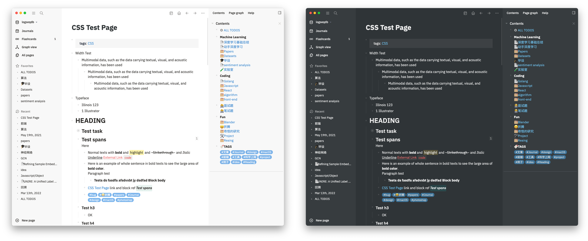
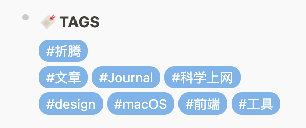

<h1 align="center">
  <br>logseq-bonofix-theme<br>
</h1>

<p align="center">
  <a href="#screenshots">🌠 Screenshots</a>
   | 
  <a href="#install">📦 Install</a>
   | 
  <a href="#whats-improved">✨ What's different</a>
   | 
  <a href="#how-to-build">🔨 How to build</a>
</p>


This is a clean theme for [Logseq](https://github.com/logseq/logseq), focusing on bullet journal and long time writing experience. Sometimes it fixes some UI bugs for Logseq.

## Screenshots

The style is strongly inspired by [logseq-bujo-theme](https://github.com/PiotrSss/logseq-bujo-theme ) and [Notion](https://notion.so). The code is mainly based on bujo theme, and you may find the style really notion-like.



## Install

Here are two ways of installing theme in Logseq.
### Install plugin


- Open Logseq → Plugins → Market Place, install **Bonofix Theme** plugin

- Open Logseq → Themes, choose your theme

> Themes installed via plugin is not compatible with your local `custom.css`. Only plugin theme works.
### Install `custom.css`

- General installation

  Copy the whole content of [custom.css](https://raw.githubusercontent.com/Sansui233/logseq-bonofix-theme/master/custom.css) into your `graphname/logseq/custom.css` file.

- If you are always working online

  Copy this one-line-installation into your logseq/custom.css file

  ```css
  @import url('https://cdn.jsdelivr.net/gh/sansui233/logseq-bonofix-theme/custom.css')
  ```

## What's different

**Functional style**

- Simple but functional colors

- Remove border-bottom for heading2, and make `<hr>` slim for title partition in blockbody. 

- Make tippy window like responsive card instead of filling the screen and obscuring text

**Additional Styles**

- Calender emoji before journal title  
  

- Rounded tags  
  

- Round checkbox 

## How to build

1. Install [node](https://nodejs.org/)
2. Clone repo  
  ```shell
  git clone https://github.com/Sansui233/logseq-bonofix-theme.git && cd logseq-bonofix-theme
  ```
3. Install sass  
  ```shell
npm install
  ```
4. Run build  

  ```shell
  npm run build
  ```

## Thanks

- [Logseq](https://github.com/logseq/logseq)
- [logseq-bujo-theme](https://github.com/PiotrSss/logseq-bujo-theme) by PiotrSss
- Dark mode of [Notion](https://notion.so)
- All feedbacks from email and discord
