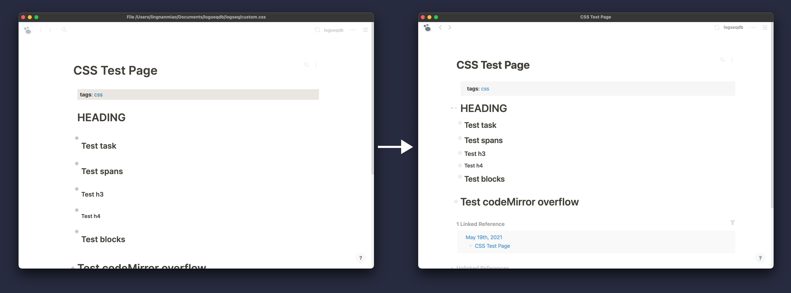
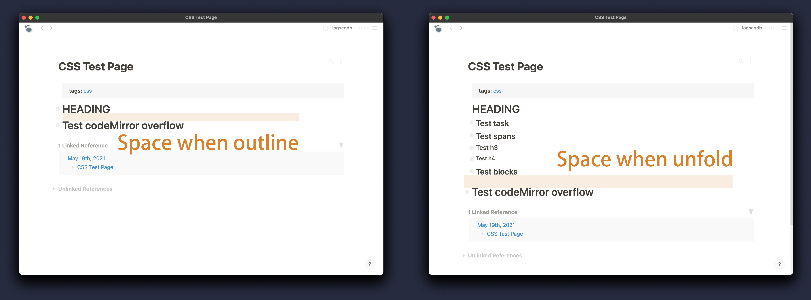
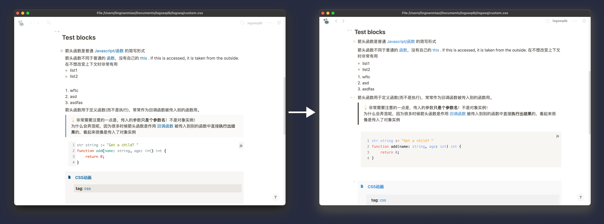

# Better Typography

## Headings' outline

For aesthetics, I like to use headings to divide sections of blocks for adding rhythm of the page. But the spacing of headings is currently not good in logseq. So I compact the space of heading blocks. 

In fact, I set all margins to 0 for headings because the 1.5 line-height can't be too sufficient. In web article typography, the line-height of h1 is often set to about 1.2 to reduce the contrast of spacing between the heading and the body text. The larger headings the smaller line height. In the future version I'll take more space rhythm into account. 

## Child Blocks

For the headings' spacing above, it's not just a simple space compress of heading. Why logseq make the space of heading so wide is that they have to make enough space before the children block following (but I think it's overdone). However besides headings, all the blocks with children means more than a sentence. To tell apart those blocks from one sentence block, it's neccessary to add more space for those who have child blocks.

You may found little difference in daily usage.  However if you collapse the first heading in the picture above, you'll find two heading level 1 don't have so much spacing. It keeps compact. And when you unfold the content, they will be  apart from each other.

You can see a clear section divide space when you unfold your content. Notice that the space is not always as wide as the picture shows above, it depends on how deep you unfold your children block. When you collapse all the block(outline mode), the space reaches to the smallest. In other words, you'll get a visual hint "this section ends here" when you have a long section with many children block.

## \<ul\> and \<ol\>

If unordered list and ordered list are adjacent, there is large space between them…… I don't know why it turns out this, so I fix it.

