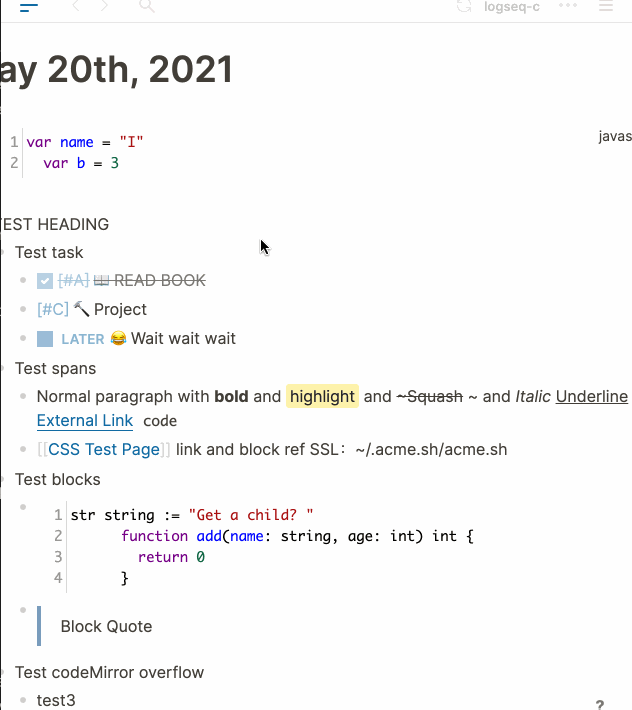
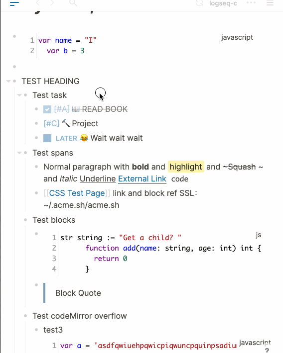

This is a bug that heavily affects small screen viewing.

With the default theme, the content won't fit the screen when the window width is not wide enough. And content on the left side is unreachable.

 


When using a mobile phone, things getting worse because users can scroll the screen in any direction (the expected scroll behavior is restricted to vertical only or horizontal only), resulting in a weak UI experience that make user feel the page not robust enough.

It's caused by flex child element's width overflows its parents. Here two potential overflowing

- `.cp__sidebar-main-content `: No width restriction

This one can be easily fixed. But the next one is hard.

- `.flex-row`: When a bullet and a code block side by side in a flex-row, the code block calculates 100% width as the .flex-row width ignoring the bullet space, which causing the code block to overflow the screen.

  In other words, if the bullet is hidden, the width of code block just works as expected. But with the bullet, the width of code block won't shrink to fit the screen.

Despite knowing the cause, the issue still can't be perfectly fixed on some devices. In `custom-desktop.css`  file, I manually add margin-right space( = bullet width) to code block to force it work well on mobile screen. But this is not a good solution because all the code blocks(including not overflowing ones) are affected. That means the width of code blocks is always shorter than other blocks. The vertical typography of right side is not fullly justified. 

Also I tried dynamic max-width solution:

```
max-width: calc(100% - 40px)
```

The flaw still exists. The most weird thing is that the first and second level `.flex-row` aren't overflowed, only the 3rd level and belows become overflowed. So the 1st and 2nd level will be short than normal with this calculation.

This flaw is not on the current web version (Chrome and Safari have been confirmed). So `custom.css` works well. And if you are using desktop app, you may never encounter this problem because your screen is always wide enough. 

Fixed:



