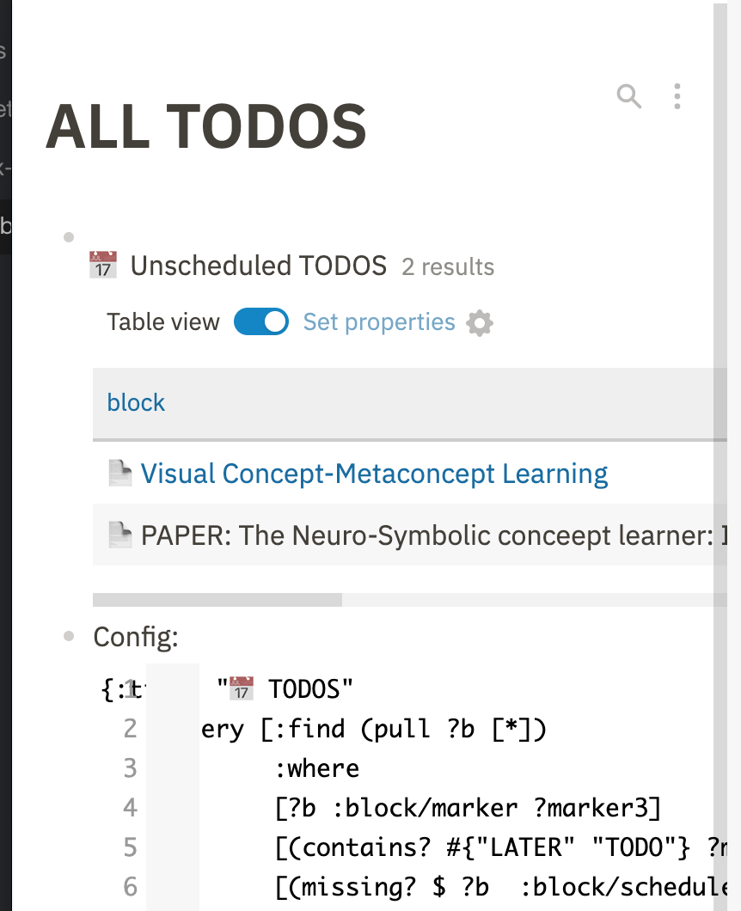
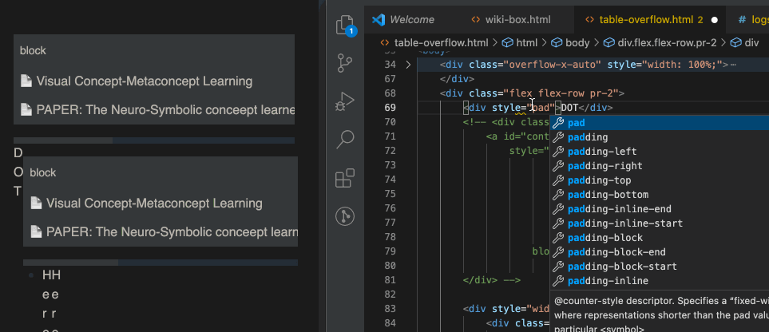
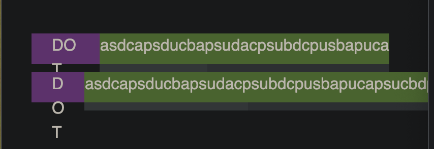

(This article is not revised yet)

For narrow screen, I add `padding=20px` to the main-container for better viewing. The expected query table padding should be like this:


However, table padding in Logseq (v0.3.2 now) is:



You would see the right space is serverly compressed, it overflows the right side of content (see the top-right icon for ref ) (And code block problem still there)

Why? Is the table unconstrained?

Nope, it has nothing to do with the table. It's a problem related to **flex row**.

## Explanation

Let us replace the bullet with string "dot". Then add padding to it. 



You can see the right block is "pushed" to right by the growning "DOT" space.

So it's the problem on the dot? No, flex-row won't leave things like that. ~~**It's because Logseq set the table container right block width to 100%.** **Setting 100% width may lead to destroy the flex box**. Because it will be based on the width of flex-parent instead of the child.~~

These two flex rows have different behaviors though the only difference is a simply div wrapper. (using logseq's style.css).

For the first ,we just let the overflow-div's container be the direct child of flex row. For the second one, the overflow-div's container is wrapped by an extra div.



```html
<style>
    body {
        padding: 30px;
    }
</style>
<body>
    <!-- Expected -->
    <div class="flex flex-row pr-2">
        <div style="padding: 0px 20px; height: 40px;background-color: rgb(125, 66, 148);height: 30px;">DOT</div>
        <div class="overflow-x-auto" style="width: 100%;">
            <div style="width: 100%;background-color: rgb(72, 100, 44);height: 30px; white-space: nowrap;">asdcapsducbapsudacpsubdcpusbapucapsucbdpaucapsucbpasudbacpsudbcpausdbcpasudbcpasudacpudbs</div>
        </div>

    </div>

    <!-- Overflow -->
    <div class="flex flex-row pr-2">
        <div style="padding: 0px 20px; height: 40px;background-color: rgb(125, 66, 148);height: 30px;">DOT</div>
        <div style="width: 100%;">
            <div class="overflow-x-auto" style="width: 100%;">
                <div style="width: 100%;background-color: rgb(72, 100, 44);height: 30px; white-space: nowrap;">asdcapsducbapsudacpsubdcpusbapucapsucbdpaucapsucbpasudbacpsudbcpausdbcpasudbcpasudacpudbs</div>
            </div>
        </div>
    </div>
</body>
```

That's why all the no-wrap divs can surpass the container in logseq, such as query table with log contents, and code block.

The code block overflow problem is solved in bonofix-theme ---- not perfectly for webkit (Safari).

## Solution

Calc padding when setting width

```css
width: calc(100% - 38px)
```